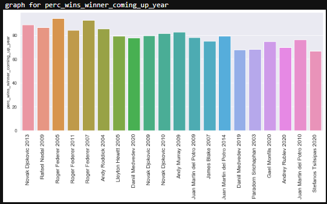
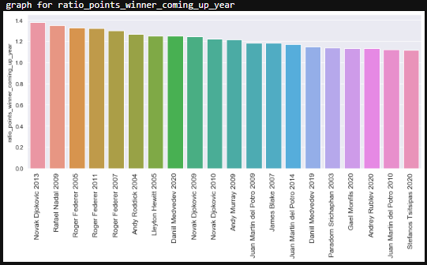
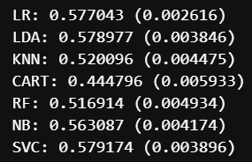

# tennis_match_predictor

* The goal of this project was to create an algorithm using supervised machine learning to predict the outcome of tennis matches by taking in account information from the players form before the match.

* I scrapped the data from ATP tournaments, matches and players from 1999 to 2020 (> 78000 matches).

* I performed data cleaning steps and feature engineering to create information of the players form at the moment of the upcoming match.

* Exploratory data analyses were carried out to get insight into the features correlation and distribution. This allowed to select the most relevant features for the model.

* I tested diferent algorithms capable of working on this classification problem:

  * Linear Algorithms: Logistic Regression (LR) and Linear Discriminant Analysis (LDA).
  * Nonlinear Algorithms: Classification and Regression Trees (CART), Support Vector Machines (SVM), Gaussian Naive Bayes (NB) and k-Nearest Neighbors (KNN).
  
* Linear Regression models preformed better in this case, and were chosen for further tunning. 

**Python Version**: 3.7

**Packages**: pandas, numpy, datetime, lxml, sklearn, scipy, matplotlib, seaborn, pickle. 

# 1. WebScrapping. 

* Using the scrapping code by serve-and-volley I obtained the ATP tournaments, matches and players data from 1999 to 2020. See [here](https://github.com/serve-and-volley/atp-world-tour-tennis-data).

# 2. Data Cleaning and Feature Engineering

* Historical information before the match were used to reflect the state of form of the players. For this I generated new features taking in account the last year player performance at each court surface (e.g. % of total matches won, ratio of points won/lost, % tiebreacks won, % first serves, % or break points converted, % returns etc).

# 3. Exploratory Data Analyses (EDA)

Looked at the distributions of the data, value counts and correlation among the various numeric variables. Below are a few highlight figures.

  

      

      

# 4. Model Selection and Tunning

Categorical variables  were transformed into dummy variables. Data was splitted into train and tests sets with a test size of 20%.

I tried different classification models and evaluated them using Score and Mean Absolute Error. 

**Model Performance**: 

Plot of the distribution of the accuracy scores using box and whisker plots:

 

I repeated this spot-check with a standardized copy of the training dataset (scaling), but this did not positively affected the performance of LR and LDA.

Hence, LR and LDA showed the most promise as a low complexity and stable model for this problem.

# 5. Productionization:

The models were saved with picke and I wrote a piece of code to obtain the parameters required by the algorithm for a given player.
